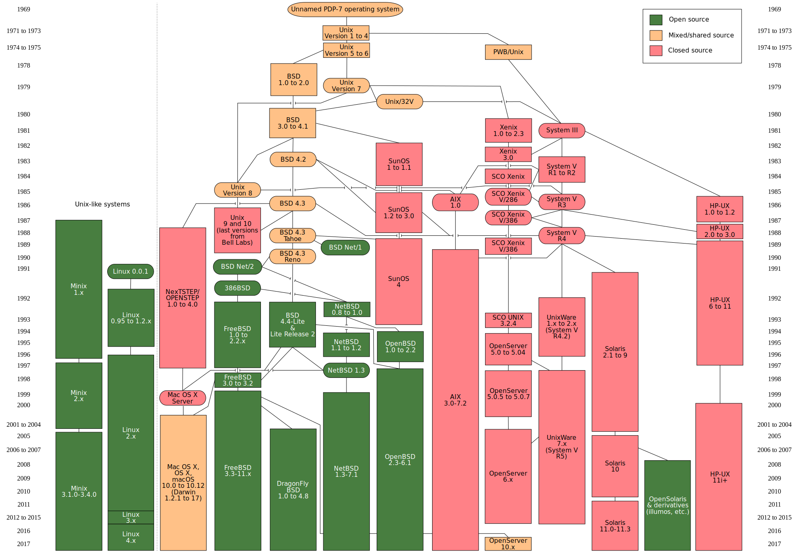

# Uma breve história do \*nix

Contada de forma bem porca e incompleta.

## Multics \(1960+\)

> O desenvolvimento inicial do Multics começou em 1964, em Cambridge, Massachusetts. Originalmente era um projeto cooperativo liderado pelo MIT junto à Genereal Eletric e o Bell Labs.

* Implementou muitas ideias dos \*nix
* Era extremamente complexo e por isso o projeto que o implementava teve de ser cancelado.

## Unix \(1970+\)

> O design e os recursos do Multics influenciaram muito o sistema operacional Unix, que foi originalmente escrito por dois programadores da Multics, Ken Thompson e Dennis Ritchie. A influência superficial do Multics no Unix é evidente em muitas áreas, incluindo a nomeação de alguns comandos. Mas a filosofia de design interno era bem diferente, concentrando-se em manter o sistema pequeno e simples, corrigindo assim algumas deficiências das Multics por causa de suas altas demandas de recursos no hardware de computador limitado da época.

* O nome Unix é um trocadilho com o Multics

AT&T começou a distribuir o Unix em universidades e o sistema começou a ficar popular. Eventualmente a empresa começou a perceber que o Unix poderia ser rentável e começou a distribuir versões comerciais do Unix.

* [System III](https://en.wikipedia.org/wiki/UNIX_System_III) e [System V](https://en.wikipedia.org/wiki/UNIX_System_V)

O pessoal de Berkeley não mostrou interesse em pagar por uma distribuição. Para evitar problemas com copyright, decidiram então pegar a última versão gratuita, reescrever do zero e distribuir de graça. E assim nasceram os BSDs.

## O Projeto GNU

## Linux \(1990+\)

Neste mesmo momento, Linus Torvalds

### Distribuições Linux

De um jeito bem simplista, uma distribuição Linux é basicamente o kernel Linux + um conjuto específico de pacotes.

## Referência

* [Multics](https://en.wikipedia.org/wiki/Multics)

