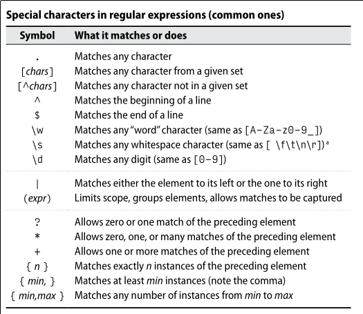

# Regex



```text
echo '1 é um numero' | sed 's/1/um/'
```

```text
echo '1 é um numero, 1 é ímpar' | sed 's/1/um/g'
```

## Metacaracteres

```text
echo 'Olar  Mundo' | sed 's/O..r/Hello/'
```

## Quantificadores

* ? - 0 ou 1
* \* - 0 ou mais
* + - 1 ou mais

```text
echo 'cooooooooooooooool' | sed 's/o\+/ºº/g'
```

```text
echo 'cooooooooooooooool, very cool' | sed -r 's/o{3,}/ºº/g'
```

